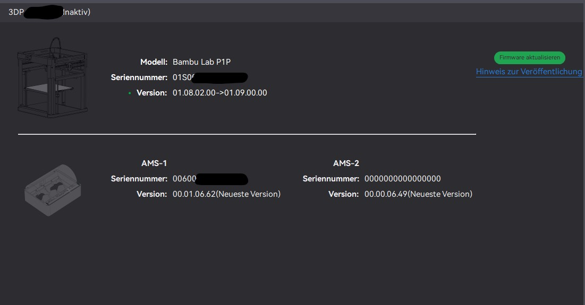
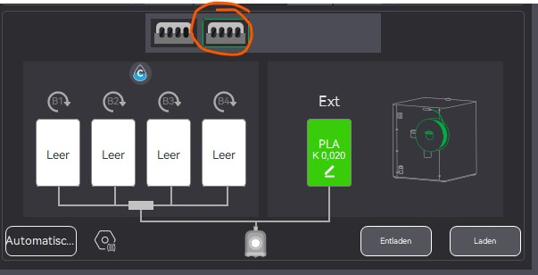
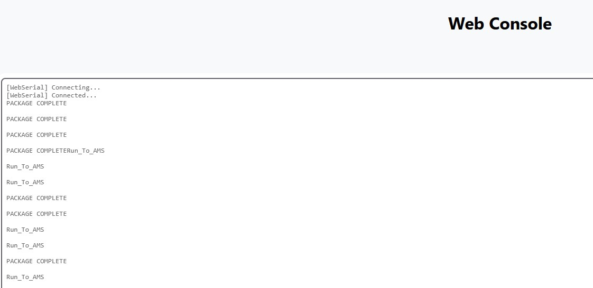

## 🖼️ Links/Sources for ESP32-S3 implementation:

This code was used as a basis and transferred to an ESP32-S3:
https://github.com/krrr/BMCU370

There is a branch with OTA and Webserial for easier analysis:
https://github.com/druckgott/bambulab_ams_diy_esp32_test/tree/ota_webserial

Additional Information:

- [Bambulab Wiki – AMS Troubleshooting](https://wiki.bambulab.com/en/x1/troubleshooting/AMS_is_not_detected_by_the_printer)
- [Bambu-Research-Group/Bambu-Bus](https://github.com/Bambu-Research-Group/Bambu-Bus)
- [09lab/BambuBus-Sniffer](https://github.com/09lab/BambuBus-Sniffer)

# 📡 ESP32-S3 ↔ MAX485 ↔ Bambulab AMS

This project demonstrates how to connect an **ESP32-S3 DevKit** with a **MAX485 module** to the **Bambulab AMS (Auxiliary Material System)**. This enables serial RS485 communication between the AMS and the ESP32-S3.

---

## 🔌 Pin Assignment ESP32-S3 ↔ MAX485

| ESP32-S3 Pin | MAX485 Pin | Description            |
|--------------|------------|-------------------------|
| GPIO 18      | RO         | RS485 → ESP32-S3 (RX)  |
| GPIO 19      | DI         | ESP32-S3 → RS485 (TX)  |
| GPIO 5       | DE & RE    | Direction control      |
| GND          | GND        | Ground                 |
| VIN (5 V)    | VCC        | MAX485 power supply    |

---

## 🔌 MAX485 ↔ AMS 6-Pin Cable

According to [Bambulab Wiki – AMS Connector Pinout](https://wiki.bambulab.com/en/x1/troubleshooting/AMS_is_not_detected_by_the_printer):

| AMS Cable (6-Pin) | Signal | MAX485 Pin | Note                          |
|-------------------|--------|------------|-------------------------------|
| Pin 1             | B      | B          | RS485 differential signal     |
| Pin 2             | A      | A          | RS485 differential signal     |
| Pin 3             | GND    | GND        | Ground                        |
| Pin 4             | 24 V   | ❌ **Do not connect** |
| Pin 5             | NC     | ❌ Not connected       |
| Pin 6             | NC     | ❌ Not connected       |

---

## ⚠️ Notes

- **Power Supply:** The MAX485 module is **not** powered by the 24 V from the AMS. Instead, it is powered by the **VIN pin of the ESP32-S3 (5 V)**.  
- **Direction Pins:** Connect DE and RE on the MAX485 **together** to GPIO 5 of the ESP32-S3.  
- **Voltage Levels:** The MAX485 operates at 5 V, and the GPIOs of the ESP32-S3 are 3.3 V tolerant → this works because the MAX485 understands TTL levels.

---

## 🖼️ Connection Diagram

```text
 Bambulab AMS (6-Pin)              MAX485                ESP32-S3
 ──────────────────────           ────────              ─────────
 Pin 1 (A)  ─────────────────────► A
 Pin 2 (B)  ─────────────────────► B
 Pin 3 (GND) ────────────────────► GND ────────────────► GND
 Pin 4 (24V) ── ✗ DO NOT USE
 Pin 5 (NC)  ── ✗
 Pin 6 (NC)  ── ✗

                             RO ────────────────► GPIO18 (RX)
                             DI ────────────────► GPIO19 (TX)
                         DE+RE ────────────────► GPIO5
                             VCC ───────────────► VIN (5V)
```

## 🖼️ Pictures





